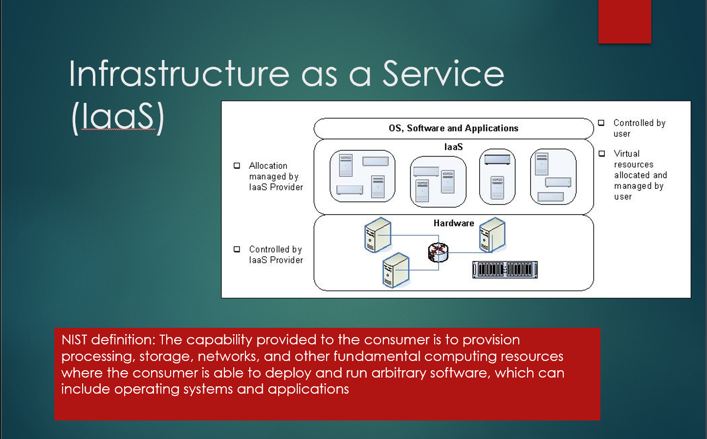
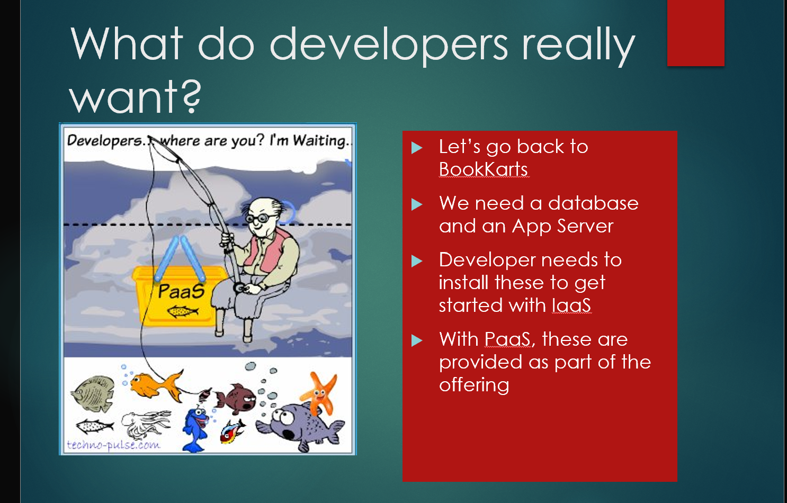
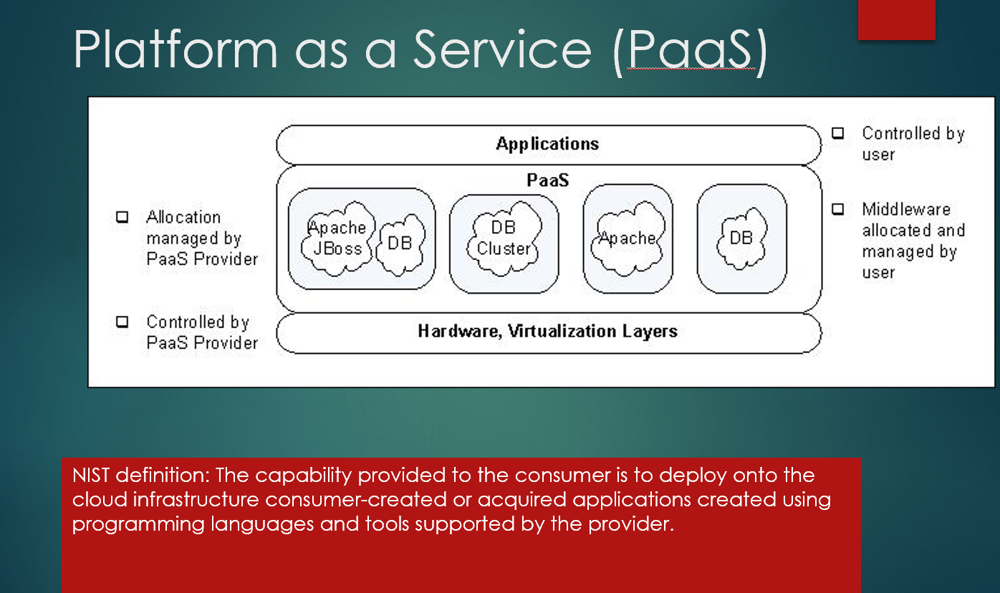
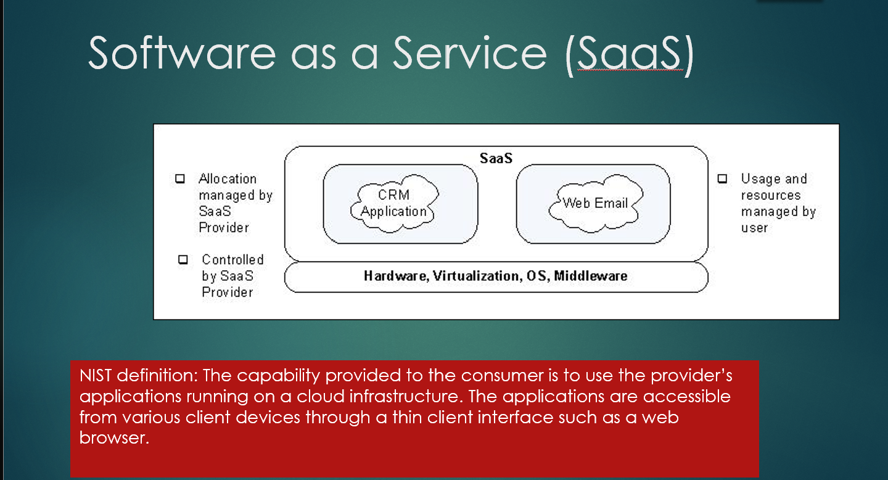

# Lecture 1 — Introduction to Cloud Computing

## 1. What is Cloud Computing?

Cloud computing is a model in which computing resources are provided over a network and can be obtained **on demand**.

Instead of buying and managing your own physical servers, you can use resources provided by a cloud infrastructure.

> **Core idea:** Computing can be treated more like a utility — use resources when needed and release them when they are no longer needed.

---

## 2. Why Cloud Computing?

The growth of the Internet and Web 2.0 created:

- More users
- More applications
- Huge amounts of data
- Greater computation requirements

Applications such as Google and Facebook require large-scale computing infrastructure.

Cloud computing allows computation to happen **"somewhere in the cloud"**, without the user needing to know or manage a particular physical server.

This connects closely with:

**Web → Big Data → Cloud Computing → AI**

---

## 3. Cloud as a Utility

The lecture uses the analogy of the **electricity grid**.

You do not normally build your own power plant. You obtain electricity from a shared grid and pay for its use.

Cloud computing follows a similar idea:

```text
Electricity:
Power Grid → User

Cloud:
Cloud Infrastructure → User
```

The goal is to make computing resources available in a similar utility-like manner.

---

## 4. NIST Definition

> Cloud computing is a model for enabling ubiquitous, convenient, on-demand network access to a shared pool of configurable computing resources that can be rapidly provisioned and released with minimal management effort or service-provider interaction.

### Important terms

- **On-demand** — obtain resources when needed
- **Network access** — resources are accessed over a network
- **Resource pooling** — resources are shared among consumers
- **Rapid provisioning/release** — resources can be quickly created and removed
- **Minimal management** — the provider handles much of the underlying infrastructure

---

## 5. Five Essential Characteristics

### 1. On-Demand Self-Service

Users can provision computing resources automatically when required without directly interacting with the service provider.

### 2. Broad Network Access

Cloud services are accessible through a network from different devices such as laptops, phones and tablets.

### 3. Resource Pooling

The provider maintains a shared pool of computing resources that can be dynamically assigned to different consumers.

This supports **multi-tenancy**.

### 4. Rapid Elasticity

Resources can be rapidly increased or decreased according to demand.

```text
Low demand  →  Fewer resources
High demand →  More resources
```

### 5. Measured Service

Cloud systems measure resource usage through metering, allowing resource consumption to be monitored and optimized.

---

# 6. Cloud Service Models

The three major service models are:

```text
IaaS → PaaS → SaaS
More control     Less control
More management  Less management
```

---

## IaaS — Infrastructure as a Service

IaaS provides fundamental computing resources such as:

- Compute
- Storage
- Networking
- Virtual machines

You can deploy and run your own software, including operating systems and applications.



### What does the user control?

```text
User
├── Operating System
├── Software
└── Applications

Cloud Provider
└── Hardware / Physical Infrastructure
```

The provider allocates the virtual resources, while the user manages those resources and the software running on them.

**Think:** *"Give me the infrastructure; I will manage the software."*

---

## What do developers really want?

Suppose we are developing **BookKarts** and need:

- A database
- An application server

With IaaS, the developer needs to install and configure these components.



With **PaaS**, these platform components can be provided as part of the offering, allowing the developer to focus more on the application.

---

## PaaS — Platform as a Service

PaaS allows developers to deploy applications onto a cloud platform using programming languages and tools supported by the provider.



### The idea

```text
User
└── Application

Cloud Provider
├── Platform / Middleware
├── Virtualization
└── Hardware
```

The provider manages the underlying infrastructure and platform, while the developer focuses primarily on the application.

**Think:** *"Give me a platform; I will build my application."*

---

## SaaS — Software as a Service

SaaS allows users to use applications provided and operated by the cloud provider.

The application is accessed through client devices, commonly using a web browser.



### The idea

```text
User
└── Uses the application

Cloud Provider
├── Application
├── Middleware
├── OS
├── Virtualization
└── Hardware
```

**Think:** *"I just want to use the software."*

---

# 7. IaaS vs PaaS vs SaaS

| | IaaS | PaaS | SaaS |
|---|---|---|---|
| Main idea | Rent infrastructure | Use a development platform | Use software |
| Control | High | Medium | Low |
| User focuses on | OS, software, applications | Applications | Using the application |
| Provider manages | Hardware/infrastructure | Infrastructure + platform | Almost everything |
| Best suited for | Users needing infrastructure control | Application developers | End users |

### Easy memory trick

**IaaS:** Infrastructure  
**PaaS:** Platform  
**SaaS:** Software

> **IaaS = I manage the machine/software**  
> **PaaS = I manage my application**  
> **SaaS = I use the application**

---

# 8. Cloud Technology Topics

The course introduces technologies and challenges such as:

- Virtualization
- Containers
- Scaling compute
- Scaling storage
- Kubernetes
- OpenStack
- Consistency
- Alternatives to relational databases
- Security
- Multi-tenancy

---

# 9. Exam Quick Revision

### Cloud Computing
On-demand access to a shared pool of configurable computing resources over a network.

### Five characteristics

1. On-demand self-service
2. Broad network access
3. Resource pooling
4. Rapid elasticity
5. Measured service

### Service models

- **IaaS → Infrastructure**
- **PaaS → Platform**
- **SaaS → Software**

### Control

```text
More control
     ↑
    IaaS
     ↓
    PaaS
     ↓
    SaaS
     ↓
Less control
```

### Main motivation

```text
Internet + Web 2.0
        ↓
More users + more data
        ↓
Large-scale computation
        ↓
Large data centers
        ↓
Cloud Computing
        ↓
Big Data / AI applications
```

> **Key idea:** Cloud computing abstracts physical infrastructure and makes computing resources available over a network in a scalable, on-demand manner.
